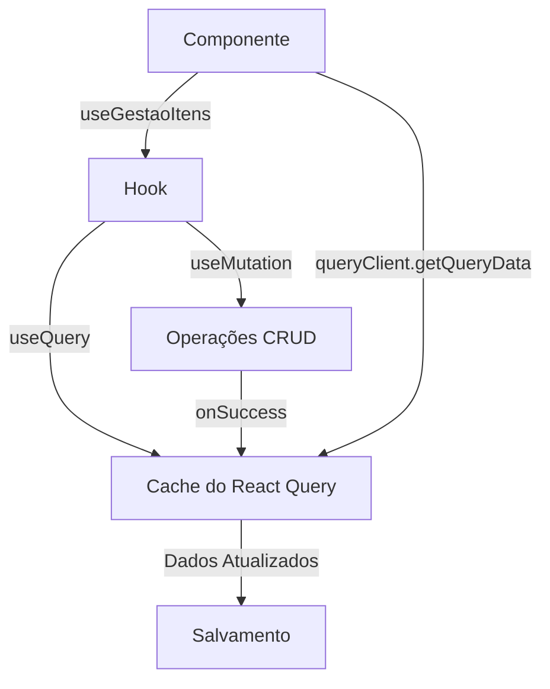

# Gerenciamento de Estado com React Query

Este documento descreve o padrão de gerenciamento de estado usando React Query (TanStack Query) implementado no projeto.

## 1. Configuração Básica

```typescript
// Configuração do QueryClient
const queryClient = new QueryClient({
  defaultOptions: {
    queries: {
      retry: false,
      refetchOnWindowFocus: false,
    },
  },
});

// Provider na raiz da aplicação
<QueryClientProvider client={queryClient}>
  <App />
</QueryClientProvider>
```

## 2. Hook de Gerenciamento de Estado

```typescript
export function useGestaoItens<T>(type: string) {
  const queryClient = useQueryClient();

  // 1. Query para buscar dados
  const { data: items = [] } = useQuery<T[]>({
    queryKey: [type],
    queryFn: async () => {
      // Sua lógica de busca aqui
      return dados;
    },
    staleTime: Infinity, // Mantém cache até invalidação manual
  });

  // 2. Mutations para CRUD
  const addMutation = useMutation({
    mutationFn: async (newItem: T) => {
      // Sua lógica de adição aqui
      return newItem;
    },
    onSuccess: (newItem) => {
      // Atualiza cache
      queryClient.setQueryData<T[]>([type], (old = []) => [...old, newItem]);
    }
  });

  const updateMutation = useMutation({
    mutationFn: async (updatedItem: T) => {
      // Sua lógica de atualização aqui
      return updatedItem;
    },
    onSuccess: (updatedItem) => {
      // Atualiza cache
      queryClient.setQueryData<T[]>([type], (old = []) => 
        old.map(item => item.id === updatedItem.id ? updatedItem : item)
      );
    }
  });

  const removeMutation = useMutation({
    mutationFn: async (id: number) => {
      // Sua lógica de remoção aqui
      return id;
    },
    onSuccess: (id) => {
      // Atualiza cache
      queryClient.setQueryData<T[]>([type], (old = []) => 
        old.filter(item => item.id !== id)
      );
    }
  });

  return {
    items,
    addItem: addMutation.mutate,
    updateItem: updateMutation.mutate,
    removeItem: removeMutation.mutate,
    isSaving: addMutation.isPending || updateMutation.isPending || removeMutation.isPending
  };
}
```

## 3. Uso em Componentes

```typescript
// Componente que usa o hook
const MeuComponente = () => {
  const queryClient = useQueryClient();
  const { items, addItem, updateItem, removeItem } = useGestaoItens<Item>('itens');

  // Para salvar dados atualizados
  const handleSave = async () => {
    // Sempre pegue os dados do cache
    const currentItems = queryClient.getQueryData<Item[]>(['itens']) || [];
    
    await saveToAPI({
      items: currentItems
    });
  };

  return (
    <div>
      {/* Seu JSX aqui */}
    </div>
  );
};
```

## 4. Fluxo de Dados



## 5. Pontos Importantes

1. **Cache Centralizado**
   - Use `queryClient.getQueryData()` para acessar dados atualizados
   - Mantenha `staleTime: Infinity` para controle manual do cache

2. **Operações CRUD**
   - Cada operação deve atualizar o cache via `onSuccess`
   - Use `setQueryData` para atualizações otimistas

3. **Salvamento de Dados**
   - Sempre use `queryClient.getQueryData()` ao salvar
   - Nunca use diretamente os dados do hook

4. **Compartilhamento de Estado**
   - Todos os componentes usando o mesmo hook veem as mesmas alterações
   - O cache é a fonte única da verdade

## 6. Exemplo de Uso

```typescript
// Adicionar item
addItem({ id: 1, nome: 'Novo Item' });

// Atualizar item
updateItem({ id: 1, nome: 'Item Atualizado' });

// Remover item
removeItem(1);

// Salvar dados atualizados
const handleSave = async () => {
  const currentItems = queryClient.getQueryData<Item[]>(['itens']) || [];
  await saveToAPI(currentItems);
};
```

## 7. Boas Práticas

1. **Cache**
   - Use `staleTime: Infinity` para controle manual
   - Atualize cache em todas as mutations
   - Acesse dados via `queryClient.getQueryData()`

2. **Mutations**
   - Mantenha lógica de atualização do cache em `onSuccess`
   - Use atualizações otimistas quando possível
   - Trate erros adequadamente

3. **Componentes**
   - Use `useQueryClient` para acessar o cache
   - Sempre pegue dados atualizados do cache ao salvar
   - Evite usar dados do hook diretamente para salvar

4. **Performance**
   - Atualizações otimistas melhoram UX
   - Cache centralizado evita refetches desnecessários
   - Controle manual do cache evita problemas de sincronização

## 8. Resolução de Problemas Comuns

1. **Dados não atualizados**
   - Verifique se está usando `queryClient.getQueryData()`
   - Confirme se `staleTime` está configurado corretamente
   - Verifique se as mutations estão atualizando o cache

2. **Problemas de Sincronização**
   - Use sempre o cache como fonte da verdade
   - Evite manter estado local redundante
   - Mantenha `staleTime: Infinity` para controle manual

3. **Performance**
   - Use atualizações otimistas
   - Evite refetches desnecessários
   - Mantenha o cache atualizado

## 9. Referências

- [Documentação do React Query](https://tanstack.com/query/latest)
- [Guia de Cache do React Query](https://tanstack.com/query/latest/docs/react/guides/caching)
- [Guia de Mutations](https://tanstack.com/query/latest/docs/react/guides/mutations) 